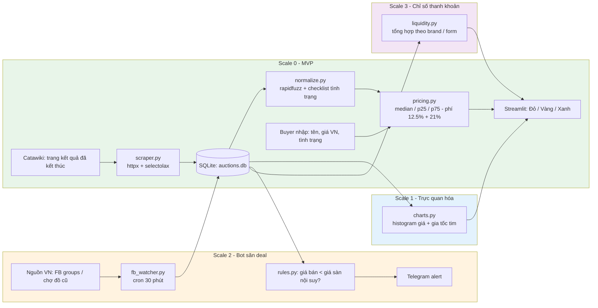
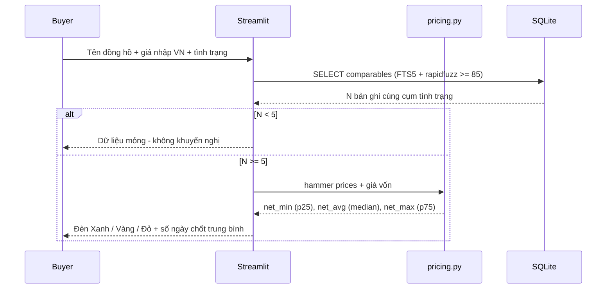
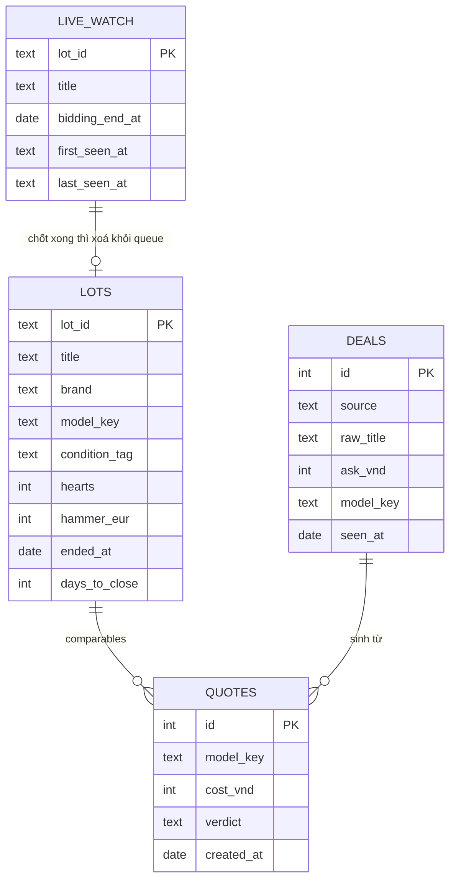
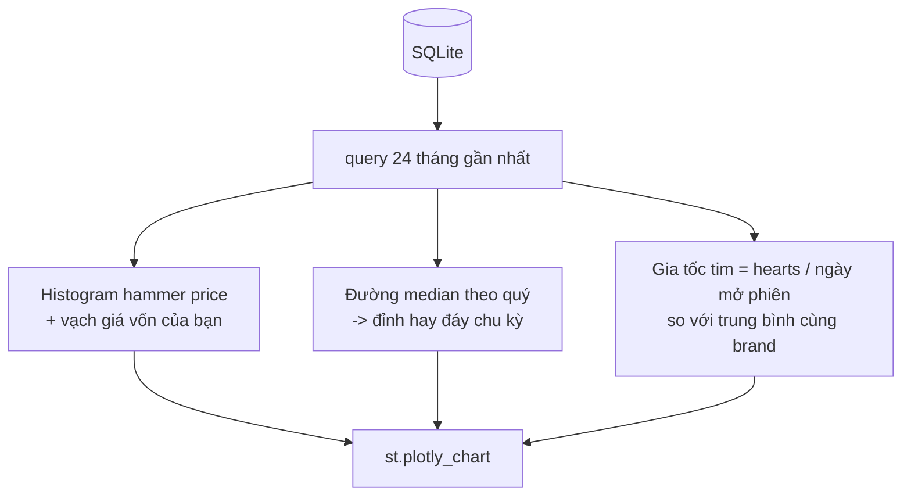
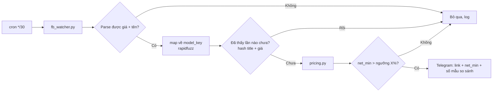
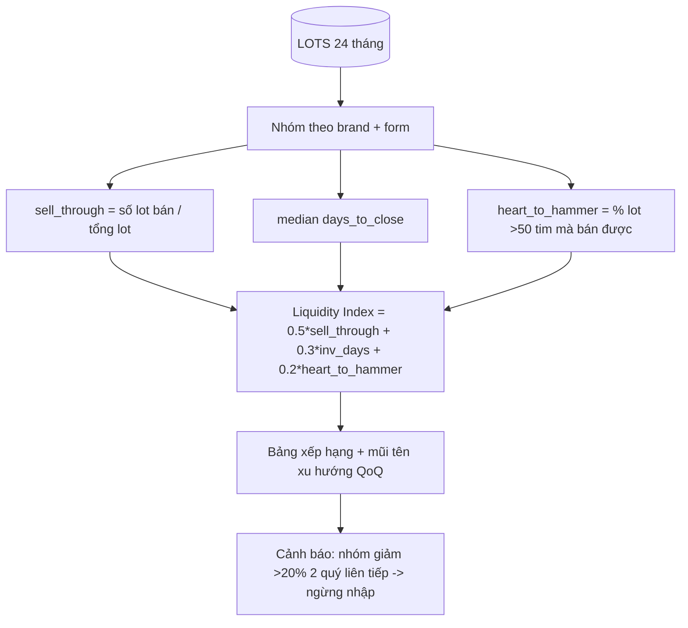
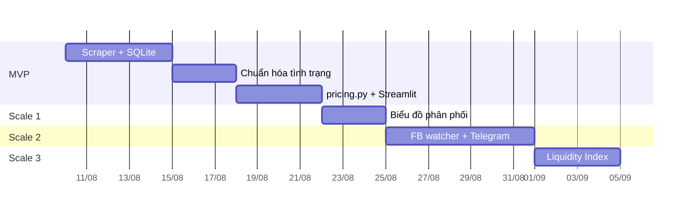
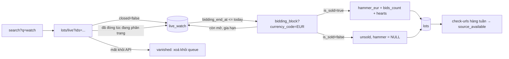

# Kiến trúc end-to-end cho CUTI-Tools

Nguyên tắc: **YAGNI** — mỗi giai đoạn chỉ thêm đúng thứ đang thiếu. Không microservice, không Kafka, không Kubernetes, không vector database.

## 0. Stack chốt (tối giản)

| Lớp | Chọn | Lý do |
| --- | --- | --- |
| Ngôn ngữ | Python 3.11 | Scraping và phân tích cùng một ngôn ngữ |
| Crawl | `httpx` + `selectolax`; chỉ dùng `playwright` cho trang chặn JS | Request thường rẻ hơn browser 20–50 lần |
| Lưu trữ | **SQLite** một file (+ FTS5 cho tìm tên) | Dữ liệu vài trăm nghìn dòng — chưa cần Postgres |
| Khớp tên/model | `rapidfuzz` | Nhanh, một dependency, đủ cho dedupe |
| Giao diện | **Streamlit** một trang | Buyer chỉ cần một form và một kết quả; chưa cần API riêng |
| Lịch chạy | `cron` hoặc GitHub Actions schedule | Không cần Airflow/Celery |
| Thông báo | Telegram Bot API (`requests.post`) | Không cần queue |
| Hosting | Một VPS 5 USD hoặc chạy local | Đủ cho 1–5 người dùng |

Không dùng ở MVP: Docker Compose nhiều service, Redis, ORM nặng, message queue, ML model. Chỉ thêm sau khi có số liệu chứng minh cần.

---

## 1. Kiến trúc tổng thể (end-to-end)



Mọi giai đoạn dùng **chung một file SQLite** và **chung module `pricing.py`**. Đây là điểm nối duy nhất cần giữ ổn định.

---

## 2. Scale 0 — MVP: luồng ra quyết định



**Công thức duy nhất cần đúng:**

```text
net = hammer * (1 - 0.125) - VAT_phí(0.21 trên phí) - ship - giá_vốn
đèn_xanh  : net_min > ngưỡng_lãi_tối_thiểu
đèn_vàng  : net_avg > ngưỡng, net_min <= ngưỡng
đèn_đỏ    : net_avg <= ngưỡng
```

Dùng **median + p25/p75** thay vì mean + độ lệch chuẩn: chống outlier tốt hơn, không cần giả định phân phối chuẩn.

### Schema SQLite (đủ dùng, 4 bảng lõi)



`condition_tag` chỉ có 4 giá trị: `naked` / `box` / `papers` / `fullset`. Không tạo bảng tình trạng riêng — YAGNI.

---

## 3. Scale 1 — Biểu đồ phân phối và sức nóng

Chỉ là thêm hai hàm vẽ vào cùng app Streamlit. Không tách service.



Dùng `plotly` (Streamlit hỗ trợ sẵn). Không cần Metabase/Superset.

---

## 4. Scale 2 — Bot đảo chiều quy trình



Giữ nguyên `pricing.py` từ Scale 0 — bot chỉ là một *caller* khác của cùng hàm. Dedupe bằng cột `UNIQUE(hash)` trong SQLite, không cần Redis.

> Rủi ro thực tế: Facebook chặn tự động hóa. Bắt đầu bằng nguồn dễ nhất (nhóm public / RSS / một tài khoản Playwright có session lưu sẵn). Nếu tỷ lệ chặn cao, chuyển sang bán tự động: buyer dán link, bot chấm điểm.

---

## 5. Scale 3 — Chỉ số thanh khoản riêng



Một view SQL và một bảng trong Streamlit. Không cần data warehouse.

---

## 6. Thứ tự triển khai



---

## 7. Ranh giới chống over-engineering

| Cám dỗ | Khi nào mới làm |
| --- | --- |
| Postgres | Khi SQLite > 5GB hoặc >2 người ghi đồng thời |
| FastAPI backend riêng | Khi có client thứ 2 ngoài Streamlit |
| Airflow / Prefect | Khi có >10 job phụ thuộc nhau |
| ML dự đoán giá | Khi median/p25/p75 sai lệch >20% so với thực tế qua 50 deal |
| Docker + CI/CD đầy đủ | Khi có người thứ 2 deploy |
| Vector search | Không bao giờ cho bài toán này — rapidfuzz đủ |

---

### Nguồn tham khảo

- `dreamingspires/auction-scraper` — scraper đấu giá có sẵn Catawiki, ghi thẳng vào SQLite, kiến trúc đáng tham khảo.
- `rapidfuzz/RapidFuzz` — fuzzy matching cho dedupe/khớp model.
- SQLite FTS5 — full-text search không cần Elasticsearch.
- Streamlit vs FastAPI: chỉ cần FastAPI khi cần API cho máy gọi máy; app dữ liệu một người dùng thì Streamlit là đủ.

---

## 8. Trạng thái triển khai (2026-08-08)

Đã hoàn tất end-to-end bằng dữ liệu mẫu:

- Scale 0: SQLite schema v2 + FTS5, normalization/reference matching,
 p25/median/p75, Streamlit và audit snapshot.
- Scale 1: histogram + vạch giá vốn, median theo quý, gia tốc tim.
- Scale 2: deal feed strict contract, dedupe, caller dùng chung pricing,
 Telegram/file notifier và SQLite outbox retry.
- Scale 3: liquidity theo `brand + form`, QoQ trên quý đã hoàn tất và cảnh báo
 giảm quá ngưỡng hai quý liên tiếp.
- Portability/reliability: local path và Windows path, giới hạn response,
 preflight trước khi ghi, migration v1→v2, deterministic fixtures và E2E.
- Correctness hardening: text-only model tách identity ảnh hưởng giá, năm không
 cue không bị nhận nhầm làm reference, không cắt ngầm comparables, input UI
 bắt buộc explicit, legacy audit được đánh dấu không replayable.
- Watch reliability: lỗi quote không bị nuốt, CLI trả non-zero khi delivery lỗi,
 outbox vẫn drain khi nguồn deal lỗi và stale deal được lọc ngay trong SQLite.

Chủ động để sau đúng theo quyết định sản phẩm: adapter crawl Catawiki thật,
adapter Facebook/marketplace thật và lịch chạy production. Các adapter này chỉ
cấp input vào contract hiện có, không thay đổi logic downstream.

---

## 9. Bắt giá búa thật trên Catawiki (2 pha)

Catawiki chỉ cho tìm kiếm lot **đang mở**, và trang lot hết hạn sau vài tháng.
Do đó không tồn tại cách "cào lịch sử giá búa" một lần: phải bắt sống rồi chốt.



Bốn kết cục của một lot trong queue, tất cả đều là kết cục cuối, không lặp vô hạn:

| Kết cục | Điều kiện | Hành động |
| --- | --- | --- |
| `sold` | `is_closed` và `is_sold` | ghi `lots` với giá búa, xoá khỏi queue |
| `unsold` | `is_closed`, không bán | ghi `lots`, `hammer_eur = NULL` |
| `still_open` | phiên được gia hạn | cập nhật `bidding_end_at`, giữ trong queue |
| `vanished` / `unclassified` | nguồn xoá lot, hoặc title không nói tình trạng | đếm lại và xoá khỏi queue |

Giới hạn cố ý: không lưu ảnh, không lưu sổ từng lần đấu, không quét dải lot id,
không Playwright, không proxy. `hearts` và `bids_count` chỉ chụp một lần tại lúc
đóng — đủ để đo sức nóng mà vẫn giữ database ở mức KISS.
