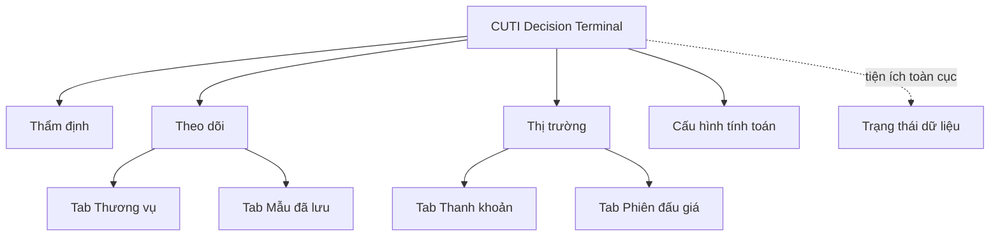

# Information Architecture

**Trạng thái:** Baseline đã chốt ngày 2026-08-25.

## Mục tiêu

IA tổ chức CUTI quanh quyết định mua hàng của người dùng, thay vì quanh các engine hoặc
công cụ nội bộ. Điều hướng chính chỉ chứa những không gian người dùng cần chủ động đi tới.

## Navigation Tree

## Luật điều hướng

- Điều hướng chính gồm bốn khu vực: **Thẩm định**, **Theo dõi**, **Thị trường** và **Cấu hình tính toán**.
- Frontend có bốn page/route tương ứng với bốn khu vực trên.
- Tìm sản phẩm, nhập thương vụ và xem kết quả diễn ra trên cùng page **Thẩm định**.
- **Theo dõi** chứa hai loại nội dung do người dùng chủ động lưu: **Thương vụ** và **Mẫu đã lưu**.
- **Thanh khoản thị trường** và **Phiên đấu giá** nằm dưới **Thị trường**.
- Thương vụ, Mẫu đã lưu, Thanh khoản và Phiên đấu giá là tab trong page cha, không phải page độc lập.
- Chọn thương vụ, mẫu, phân khúc hoặc lô mở detail panel bên phải trong page hiện tại; không điều hướng sang một page detail mới.
- Trạng thái lô như **Đang mở** và **Chờ kết quả** là bộ lọc trong Phiên đấu giá, không phải các trang điều hướng riêng.
- **Trạng thái dữ liệu** là tiện ích toàn cục mở bằng popover, không phải page và không chiếm vị trí ngang hàng với ba khu vực chính.
- **Cấu hình tính toán** là page vận hành để chỉnh tham số, helper và hai công thức pricing bắt buộc; đây là một khu vực điều hướng độc lập, không phải panel trong Thẩm định.
- Kết luận, dữ liệu so sánh, biên lợi nhuận, rủi ro và bối cảnh thanh khoản là nội dung theo ngữ cảnh của một lần thẩm định; chúng không phải các trang điều hướng độc lập.
- Streamlit, crawler, settlement và công cụ quản trị nằm ngoài IA của frontend dành cho người dùng cuối.

## Core User Journeys

### 1. Đánh giá một cơ hội mua

Người dùng xác định đúng sản phẩm và nhập thông tin thương vụ, xem cơ sở quyết định,
nhận kết luận cùng mức giá mua, rồi quyết định mua, thương lượng hoặc bỏ qua.

Nếu hành trình này gãy, sản phẩm không thực hiện được giá trị cốt lõi.

### 2. Lưu và theo dõi thứ người dùng quan tâm

Người dùng chủ động lưu một mẫu đồng hồ để xem lại, hoặc lưu một kết quả thẩm định thành
thương vụ để theo dõi từ lúc cân nhắc đến khi đã mua hoặc bỏ qua.

Nếu hành trình này gãy, sản phẩm chỉ hỗ trợ quyết định tức thời và không giúp người dùng
duy trì công việc qua nhiều lần sử dụng.

### 3. Khám phá thị trường và lô đấu giá

Người dùng xem sức khỏe phân khúc, tìm hoặc lọc các lô đấu giá, mở chi tiết một lô rồi
chuyển sang thẩm định khi phát hiện cơ hội phù hợp.

Nếu hành trình này gãy, người dùng thiếu bối cảnh và nguồn cơ hội để đưa vào luồng thẩm định.

Độ phủ, độ mới và tình trạng nguồn dữ liệu là yêu cầu xuyên suốt cả ba hành trình, không
phải một hành trình độc lập.

### 4. Điều chỉnh cấu hình tính toán

Người vận hành xem cấu hình active, chỉnh tham số hoặc biểu thức được phép, chạy preview
với `hammer_eur` và `cost_eur`, rồi chủ động áp dụng. Cấu hình lỗi hoặc revision cũ không
được thay thế cấu hình active.

## Ngoài phạm vi của IA này

- Cấu trúc màn hình quản trị nội bộ.
- Chi tiết control, nút bấm và bố cục trực quan.
- Luật xếp hạng tìm kiếm; luật này thuộc feature spec Product Search.
- Contract dữ liệu giữa frontend và backend.
