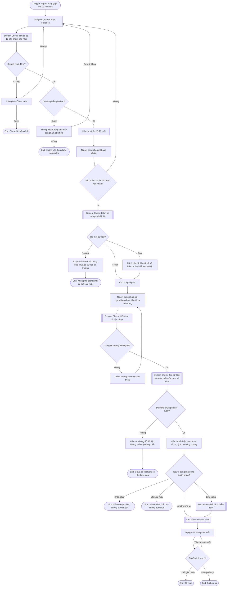

# Core Journey: Thẩm định cơ hội mua

**Trạng thái:** UX flow và cognitive bottleneck coverage đã chốt ngày 2026-08-25.  
**Phạm vi xác nhận:** Contract-level. Chưa qua usability test trên prototype.

## User Flow

## Cognitive Bottleneck Coverage

| Bottleneck | Behavior bắt buộc | Trạng thái coverage |
|---|---|---|
| Chọn nhầm sản phẩm | Tên chuẩn và reference; exact reference đứng đầu; không tự chọn; sửa tên hủy xác nhận và kết quả cũ | Covered by contract |
| Nhầm giữa đã nhập và đã chọn | Hiện trạng thái Đã xác nhận; chưa chọn đề xuất thì không được thẩm định | Covered by contract |
| Không biết dữ liệu còn đáng tin không | Fresh không gây nhiễu; Stale cảnh báo nhưng cho tiếp tục; No data chặn và giải thích | Covered by contract |
| Nhập sai giá hoặc tiền tệ | Giá và tiền tệ đi cùng nhau; không tự chọn tiền tệ; định dạng rõ; lỗi đặt tại trường và giữ nguyên input | Covered by contract |
| Quá tải khi đọc kết quả | Thứ tự Kết luận → Mức mua tối đa → Khoảng cách giá → Lý do → Bằng chứng; không chỉ dùng màu | Covered by contract |
| Nhầm Lưu mẫu với Lưu thương vụ | Hai hành động đặt ở hai ngữ cảnh khác nhau và phản hồi nói rõ thứ vừa được lưu | Covered by contract |
| Tưởng rằng kết quả đã tự lưu | Hiện Chưa lưu; rời luồng không tạo lịch sử; không dùng modal cản trở | Covered by contract |
| Không tìm thấy sản phẩm | Giữ truy vấn, cho sửa và tìm lại, không đoán hoặc tự tạo sản phẩm | Safely handled; intentional YAGNI gap |

## Quy tắc trình bày tối thiểu

- **Lưu mẫu** nằm gần định danh sản phẩm.
- **Lưu thương vụ** nằm tại kết quả thẩm định.
- Sau khi lưu mẫu, phản hồi phải nói rõ kết quả thẩm định chưa được lưu.
- Kết quả chưa lưu phải được nhận biết mà không cần mở thêm hộp thoại.
- Không dùng popup cho cảnh báo dữ liệu cũ hoặc khi người dùng rời kết quả chưa lưu.
- Không thêm ảnh sản phẩm, wizard, onboarding hoặc hệ trợ giúp phức tạp để giải quyết các bottleneck này trong phiên bản đầu.

## Phần còn phải kiểm chứng

Coverage phía trên xác nhận rằng mỗi rủi ro đã có behavior xử lý, không xác nhận rằng cách
trình bày đã dễ hiểu trong thực tế. Sau khi có wireframe hoặc prototype, cần kiểm tra tối thiểu:

- người dùng có nhận ra họ phải chọn một đề xuất hay không;
- người dùng có phân biệt đúng Lưu mẫu và Lưu thương vụ hay không;
- người dùng có hiểu Stale vẫn dùng được còn No data thì không hay không;
- người dùng có tìm được kết luận và mức mua tối đa mà không đọc toàn bộ bằng chứng hay không.

